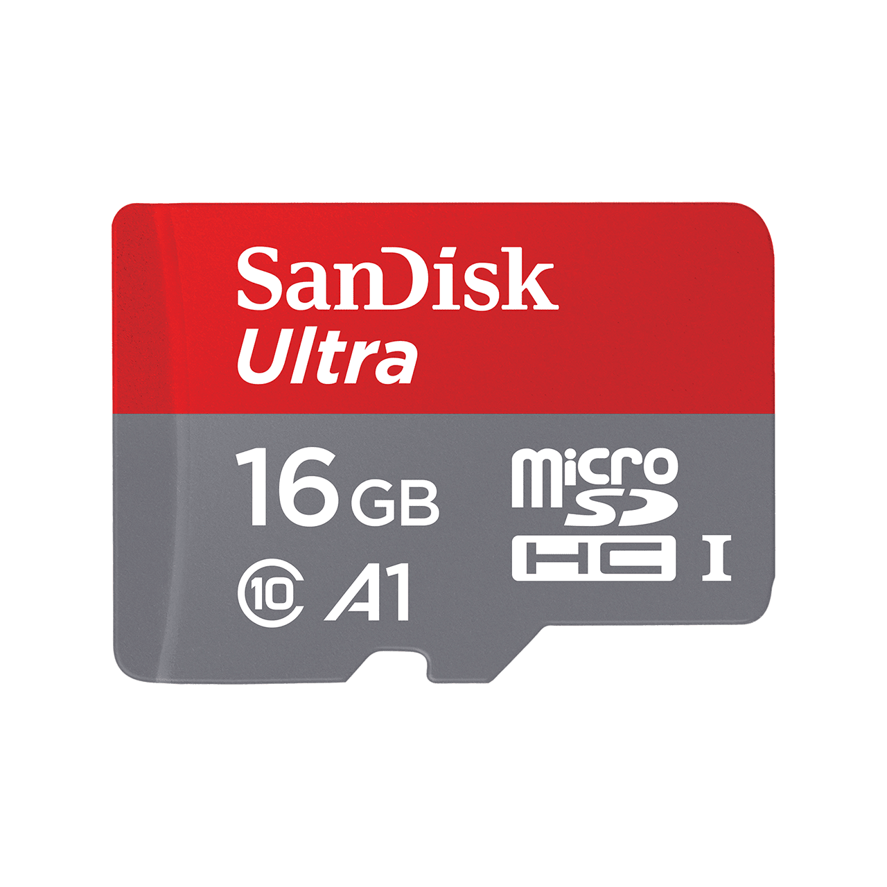
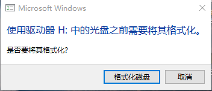
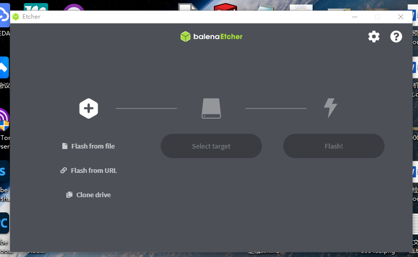
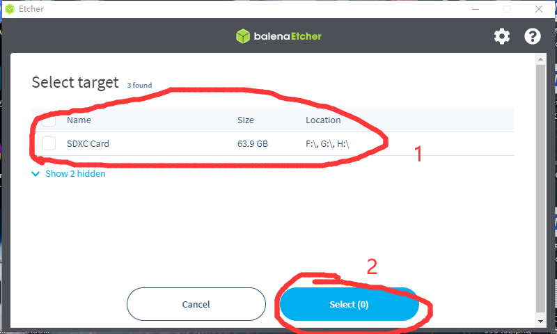
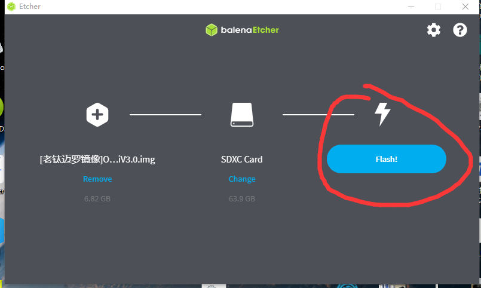
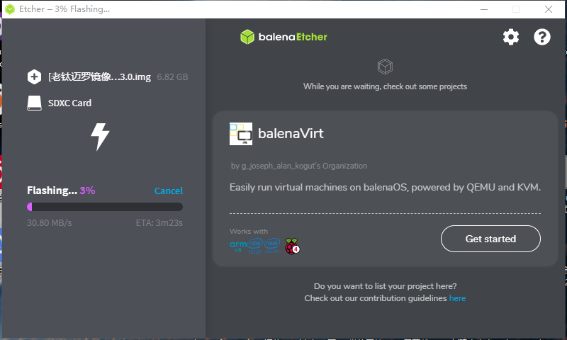

# 刷写钛迈罗系统镜像

## 1、软件准备

1、一台安装windows系统的电脑

2、下载软件以及系统镜像


balenaEtcher-Portable-1.5.109.exe 为镜像烧写软件

\[老钛迈罗镜像]OrangepiV3.0.img 为orangepi版本的钛迈罗镜像

\[新钛迈罗镜像]nanopiV3.1.img 为nanopi版本的钛迈罗镜像



balenaEtcher-Portable-1.5.109



请根据以下链接，判断钛迈罗为何版本，再下载对应镜像！！！



[2-wo-de-tai-mai-luo-shi-shi-mo-ban-ben-de.md](../../qi-ta/faq/2-wo-de-tai-mai-luo-shi-shi-mo-ban-ben-de.md)


{% embed url="https://download.interweave.top:8002/TAI%E6%99%BA%E8%83%BD%E8%BD%A6/%E9%92%9B%E8%BF%88%E7%BD%97%E8%BD%AF%E4%BB%B6/[%E8%80%81%E9%92%9B%E8%BF%88%E7%BD%97%E9%95%9C%E5%83%8F]OrangepiV3.0.img" %}
\[老钛迈罗镜像]OrangepiV3.0.img


{% embed url="https://download.interweave.top:8002/TAI%E6%99%BA%E8%83%BD%E8%BD%A6/%E9%92%9B%E8%BF%88%E7%BD%97%E8%BD%AF%E4%BB%B6/[%E6%96%B0%E9%92%9B%E8%BF%88%E7%BD%97%E9%95%9C%E5%83%8F]nanopiV3.1.img" %}
\[新钛迈罗镜像]nanopiV3.1.img


## 2、TF卡准备

1、按以下教程拆开钛迈罗，取下TF卡


[tai-mai-luo-chai-ji.md](../ying-jian/tai-mai-luo-chai-ji.md)


<figure><figcaption>
SanDisk Ultra
</figcaption></figure>

 

<figure><figcaption>
Samsung EVO Plus
</figcaption></figure>

2、将TF卡插入读卡器，并插入电脑。


如遇以下提示，请勿点击格式化，点击取消，并关闭无关窗口


<figure><figcaption></figcaption></figure>

## 3、写入系统镜像至TF卡

1、打开软件balenaEtcher-Portable-1.5.109

<figure><figcaption>
balenaEtcher-Portable-1.5.109
</figcaption></figure>

2、点击Flash from file，选择刚下载完成的系统镜像

<figure><figcaption></figcaption></figure>

3、点击select target ，选择要刷写的TF卡

<figure><figcaption></figcaption></figure>

4、点击flash进行刷写，并等待其刷写完成


刷写过程中请勿断开与TF卡的连接，或者关闭软件，这将导致系统刷写失败


<figure><figcaption></figcaption></figure>

<figure><figcaption></figcaption></figure>

## 4、结束

1、刷写完成后，关闭软件，拔出读卡器，将TF卡取出

2、将TF卡插回原处，并安装好钛迈罗车身

3、开机测试，如果恢复正常，则刷机成功
