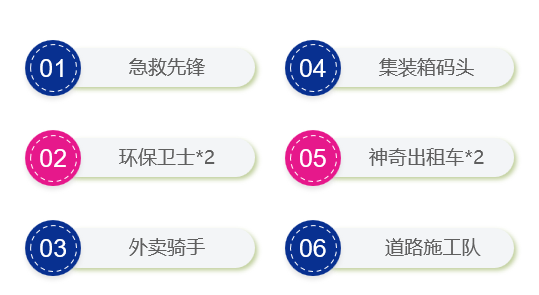

# 赛前须知

## 比赛介绍

### 1、比赛地图

<figure><figcaption></figcaption></figure>

* 整体环境为一个最大范围不超过3.04m×3.08m的赛道
* 整体环境为一个模拟城市道路的智能车场地，道路中设计多个任务点，各任务点将根据难度差异设置不同分值
*   竞赛场地是由单一规格EVA赛道拼接起来的可变赛道，EVA模块尺寸为44cm×44cm。

    <mark style="color:red;">注</mark>：车道线为白色，线粗2cm，车道宽20cm

### 2、任务介绍

<figure><figcaption>
智慧城市任务
</figcaption></figure>

<mark style="color:red;">**具体任务以及其分值请下载下面文档，以查看赛前须知**</mark>


